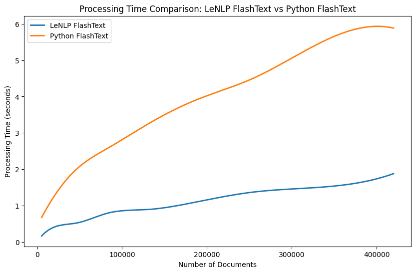

<div align="center">
  <h1>LeNLP</h1>
  <p>Natural Language Processing toolbox for Python with Rust</p>
</div>

<p align="center"></p>

<div align="center">
  <!-- License -->
  <a href="https://opensource.org/licenses/MIT"></a>
</div>


LeNLP is a toolkit dedicated to natural language processing (NLP). It provides optimized and parallelized functions in Rust for use in Python, offering high performance and ease of integration.

## Installation

We can install LeNLP using:

```
pip install lenlp
```

## Sections

- [Installation](#installation)
- [Quick Start](#quick-start)
- [Sparse Module](#sparse-module)
    - [CountVectorizer](#countvectorizer)
    - [TfidfVectorizer](#TfidfVectorizer)
    - [BM25Vectorizer](#bm25vectorizer)
- [FlashText](#flashtext)
- [Extras](#extras)
    - [Counter](#counter)
    - [Normalizer](#normalizer)

## Quick Start

### Sparse Module

The `sparse` module offers a variety of vectorizers and transformers for text data. These sparse matrices are `scipy.sparse.csr_matrix` objects, optimized for memory usage and speed. They can be used as drop-in replacements for `scikit-learn` vectorizers.

#### CountVectorizer

The `CountVectorizer` converts a list of texts into a sparse matrix of token counts. This is a Rust implementation of the `CountVectorizer` from `scikit-learn`.

```python
from lenlp import sparse

vectorizer = sparse.CountVectorizer(
    ngram_range=(3, 5), # range of n-grams
    analyzer="char_wb", # word, char, char_wb
    normalize=True, # lowercase and strip accents
    stop_words=["based"], # list of stop words
)
```

You can fit the vectorizer and transform a list of texts into a sparse matrix of token counts:

```python
X = [
    "Hello World", 
    "Rust based vectorizer"
]

matrix = vectorizer.fit_transform(X)
```

Or use separate calls:

```python
vectorizer.fit(X)
matrix = vectorizer.transform(X)
```

Benchmark:

<p align="center"></p>

LeNLP CountVectorizer versus Sklearn CountVectorizer `fit_transform` with `char` analyzer.

#### TfidfVectorizer

The `TfidfVectorizer` converts a list of texts into a sparse matrix of tf-idf weights, implemented in Rust.

```python
from lenlp import sparse

vectorizer = sparse.TfidfVectorizer(
    ngram_range=(3, 5), # Range of n-grams
    analyzer="char_wb", # Options: word, char, char_wb
    normalize=True, # Lowercase and strip accents
    stop_words=["based"] # List of stop words
)
```

Fit the vectorizer and transform texts:

```python
X = [
    "Hello World", 
    "Rust based vectorizer"
]

matrix = vectorizer.fit_transform(X)
```

Or use separate calls:

```python
vectorizer.fit(X)
matrix = vectorizer.transform(X)
```

Benchmark:

<p align="center"></p>

LeNLP TfidfVectorizer versus Sklearn TfidfVectorizer `fit_transform` with `char` analyzer. 

#### BM25Vectorizer

The `BM25Vectorizer` converts texts into a sparse matrix of BM25 weights, which are more accurate than tf-idf and count weights.

```python
from lenlp import sparse

vectorizer = sparse.BM25Vectorizer(
    ngram_range=(3, 5), # Range of n-grams
    analyzer="char_wb", # Options: word, char, char_wb
    normalize=True, # Lowercase and strip accents
    stop_words=["based"] # List of stop words
)
```

Fit the vectorizer and transform texts:

```python
X = [
    "Hello World", 
    "Rust based vectorizer"
]

matrix = vectorizer.fit_transform(X)
```

Or use separate calls:

```python
vectorizer.fit(X)
matrix = vectorizer.transform(X)
```

Benchmark:

<p align="center"></p>


LeNLP BM25Vectorizer versus LeNLP TfidfVectorizer `fit_transform` with `char` analyzer. BM25Vectorizer counterpart is not available in Sklearn.

### FlashText

The `flashtext` module allows for efficient keyword extraction from texts. It implements the FlashText algorithm as described in the paper *[Replace or Retrieve Keywords In Documents At Scale](https://arxiv.org/pdf/1711.00046)*.

```python
from lenlp import flash

flash_text = flash.FlashText(
    normalize=True # remove accents and lowercase
) 

# Add keywords we want to retrieve:
flash_text.add(["paris", "bordeaux", "toulouse"])
```

Extract keywords and their positions from sentences:

```python
sentences = [
    "Toulouse is a city in France, it's in the south compared to bordeaux, and bordeaux",
    "Paris is the capital of France, it's in the north compared to bordeaux, and toulouse",
]

flash_text.extract(sentences)
```

Output:

```python
[[('toulouse', 0, 8), ('bordeaux', 60, 68), ('bordeaux', 74, 82)],
 [('paris', 0, 5), ('bordeaux', 62, 70), ('toulouse', 76, 84)]]
```

The FlashText algorithm is highly efficient, significantly faster than regular expressions for keyword extraction. LeNLP's implementation normalizes input documents by removing accents and converting to lowercase to enhance keyword extraction.

Benchmark:

<p align="center"></p>

LeNLP FlashText is benchmarked versus the official implementation of [FlashText](https://github.com/vi3k6i5/flashtext).

### Extras

#### Counter

The counter module allows to convert a list of texts into a dictionary of token counts.

```python
from lenlp import counter

sentences = [
    "Toulouse is a city in France, it's in the south compared to bordeaux, and bordeaux",
    "Paris is the capital of France, it's in the north compared to bordeaux, and toulouse",
]

counter.count(
    sentences,
    ngram_range=(1, 1), # Range of n-grams
    analyzer="word", # Options: word, char, char_wb
    normalize=True, # Lowercase and strip accents
    stop_words=["its", "in", "is", "of", "the", "and", "to", "a"] # List of stop words
)
```

Output:

```python
[{'compared': 1,
  'south': 1,
  'city': 1,
  'toulouse': 1,
  'bordeaux': 2,
  'france': 1},
 {'toulouse': 1,
  'france': 1,
  'capital': 1,
  'paris': 1,
  'north': 1,
  'compared': 1,
  'bordeaux': 1}]
```

#### Normalizer

The normalizer module allows to normalize a list of texts by removing accents and converting to lowercase.

```python
from lenlp import normalizer

sentences = [
    "Toulouse is a city in France, it's in the south compared to bordeaux, and bordeaux",
    "Paris is the capital of France, it's in the north compared to bordeaux, and toulouse",
]

normalizer.normalize(sentences)
```

Output:

```python
[
	'toulouse is a city in france its in the south compared to bordeaux and bordeaux',
 	'paris is the capital of france its in the north compared to bordeaux and toulouse',
]
```

## References

- *[FlashText](https://github.com/vi3k6i5/flashtext)*
- *[Scikit Learn](https://github.com/scikit-learn/scikit-learn)*
- *[PyO3](https://github.com/PyO3/pyo3)* 
- *[Maturin](https://github.com/PyO3/maturin)*

